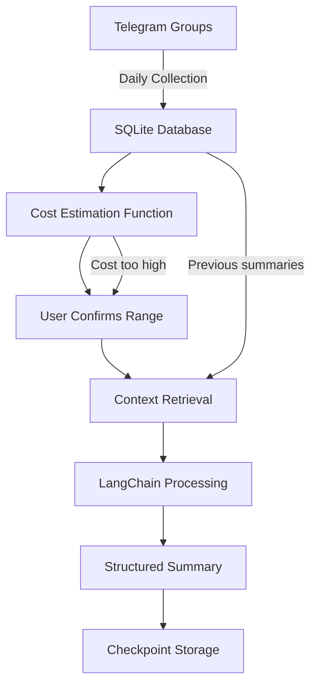

# 🧠 Crypto Community Insights Agent

> An AI-powered agent that monitors Telegram communities, estimates costs, and generates on-demand summaries with context from previous checkpoints.

---

## 🚀 Overview

Crypto projects evolve quickly, and staying updated across Telegram channels can be overwhelming.  
This project solves that by **automating message collection and providing cost-controlled summarization** on demand.

- 📩 Collects messages daily from selected Telegram groups.  
- 💾 Stores everything in SQLite for efficient access.  
- 💰 **Estimates costs** before processing to help you make informed decisions.  
- 🤖 Uses **LangChain + LLMs** to generate summaries on-demand.  
- 🔗 Provides direct links to important messages.  
- 📚 Maintains context across summaries using checkpoint system.  

---

## ✨ Features

- **Daily Message Collection**: Automatically extracts and stores messages from Telegram groups.
- **Cost Estimation**: Calculates expected LLM processing costs before summarization.
- **Checkpoint Summaries**: Generate summaries for specific date ranges with context from previous summaries.
- **Project Analysis**: One-time analysis of project documentation for better context.
- **SQLite Storage**: Efficient local database for message storage and retrieval.
- **Flexible Date Ranges**: Choose any date range for summarization based on cost estimates.

---

## 🏗️ High-Level Architecture

---

This project represents a **unique opportunity** to automate crypto community intelligence using cutting-edge AI, with potential to **scale rapidly** and generate **significant value** for users who need to track multiple projects simultaneously.

