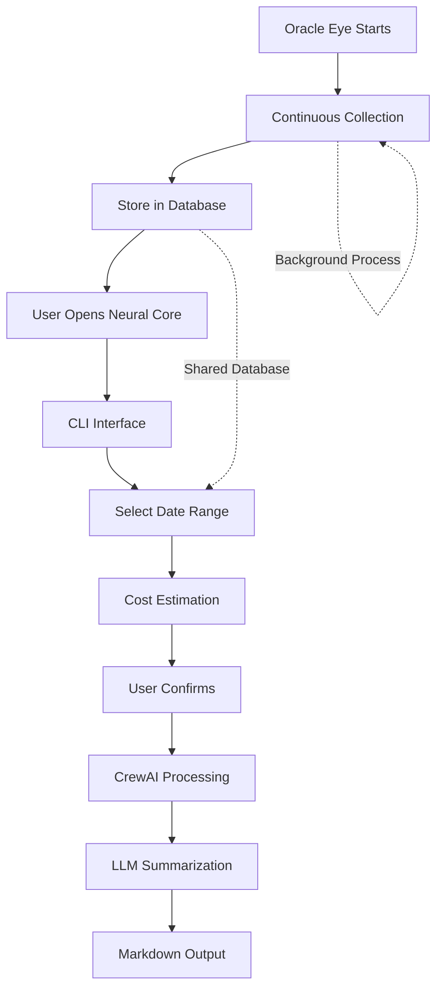

# How It Works

## Service Architecture

The system is built as **two independent services** that communicate through a shared database:

### **🔄 Oracle Eye Service**
- **Purpose**: Continuous message collection from Telegram
- **Operation**: Runs independently in background
- **Communication**: Writes messages to shared database
- **Dependencies**: Telethon, SQLModel, Scheduler

### **🤖 Neural Core Service**
- **Purpose**: AI processing and user interface
- **Operation**: Runs on-demand via CLI commands
- **Communication**: Reads from shared database
- **Dependencies**: CrewAI, Typer, SQLModel

---

## Simple Flow

1. **Setup:** Oracle Eye starts collecting messages automatically
2. **Collection:** Messages are stored in shared database
3. **Processing:** User requests summary via Neural Core CLI
4. **Result:** AI generates structured summary from collected data

---

## Technical Details

### **Oracle Eye - Intelligent Collection**
- Monitors public Telegram groups continuously
- Collects only text and links (no media)
- Uses checkpoint system for efficiency
- Configurable frequency (default: daily)
- **Independent operation** - no external dependencies

### **Neural Core - AI Processing**
- CrewAI coordinates the summary process
- Automatically identifies relevant content
- Generates summaries in markdown format
- Filters noise and spam
- **On-demand execution** - only runs when needed

### **Shared Database - Communication Layer**
- SQLite database accessible by both services
- Messages, projects, and summaries storage
- **Loose coupling** - services don't communicate directly
- **Data consistency** through database transactions

### **Cost Control**
- Estimates cost before processing
- Allows adjusting period if cost is too high
- Total transparency in expenses

---

## Visual Workflow

## Service Independence Benefits

- **🔄 Independent Operation**: Oracle Eye runs continuously, Neural Core runs on-demand
- **🚀 Independent Scaling**: Scale each service based on different needs
- **🧪 Independent Testing**: Test services in isolation
- **🔧 Independent Updates**: Update one service without affecting the other
- **📊 Independent Monitoring**: Monitor each service's performance separately

---

## Benefits

- **Time:** Saves hours of manual reading
- **Quality:** AI identifies what really matters
- **Control:** Know the cost before processing
- **Simplicity:** Command line interface
- **Reliability:** Service independence ensures system stability
- **Flexibility:** Run services on different machines if needed