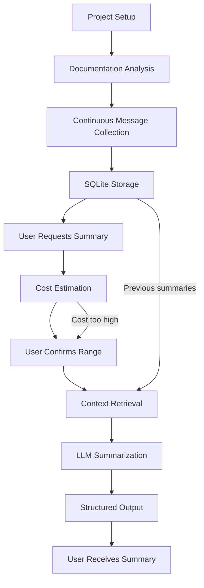

# How It Works

Our agent transforms chaotic Telegram conversations into **clear, structured insights**.  
Here's the simple flow:

---

## Step-by-Step

1. **Project Setup**  
   - You provide a Telegram group link and project documentation URL.  
   - The system analyzes the documentation once to understand the project context.  
   - This analysis is stored and reused for all future summaries.  

2. **Continuous Message Collection**  
   - Our system continuously reads messages from the chosen Telegram groups/channels.  
   - It captures text, media, and links, but ignores spam and irrelevant chatter.  
   - All messages are stored in SQLite database with timestamps.  

3. **On-Demand Summarization**  
   - When you want a summary, you select a date range.  
   - The system counts messages in that range and estimates the processing cost.  
   - You can adjust the range if the cost is too high.  

4. **Context-Aware Processing**  
   - The system retrieves the most recent previous summary as context.  
   - It processes only the new messages in your selected range.  
   - The LLM generates a summary that builds on previous context.  

5. **Output Generation**  
   - You receive:  
     - A **Structured Summary** with highlights and context.  
     - **Direct links** to important Telegram messages.  
     - **Cost report** showing actual processing expenses.  
     - Optional **Twitter/X Thread** draft for sharing.  

---

## Visual Workflow

## Key Concepts

### Checkpoint System
- **Previous summaries** are stored as checkpoints
- **New summaries** build on the most recent checkpoint
- **Context continuity** is maintained across summaries
- **Cost efficiency** by not reprocessing old messages

### Cost Estimation
- **Message count** determines processing cost
- **Date range selection** allows cost control
- **Real-time estimation** before processing
- **User decision** based on cost vs. value

### Project Analysis
- **One-time process** per monitored project
- **Documentation understanding** for better context
- **Stored permanently** in database
- **Reused** for all future summaries

## Why It's Powerful

- **Efficiency**: Only processes new messages, not entire history
- **Cost Control**: Know the cost before processing
- **Continuity**: Each summary connects with previous ones
- **Transparency**: Direct message links for verification
- **Flexibility**: Choose any date range for summarization