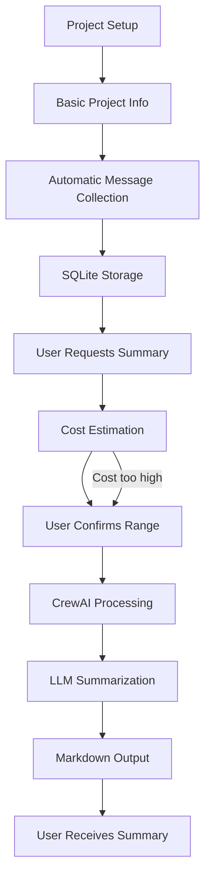

# How It Works

## Simple Flow

1. **Setup:** Provide Telegram group and project name
2. **Automatic Collection:** System collects messages daily
3. **Processing:** AI identifies and summarizes what's important
4. **Result:** You receive a structured summary

---

## Technical Details

### Intelligent Collection
- Monitors public Telegram groups
- Collects only text and links (no media)
- Uses checkpoint system for efficiency
- Configurable frequency (default: daily)

### AI Processing
- CrewAI coordinates the summary process
- Automatically identifies relevant content
- Generates summaries in markdown format
- Filters noise and spam

### Cost Control
- Estimates cost before processing
- Allows adjusting period if cost is too high
- Total transparency in expenses

---

## Visual Workflow

## Benefits

- **Time:** Saves hours of manual reading
- **Quality:** AI identifies what really matters
- **Control:** Know the cost before processing
- **Simplicity:** Command line interface